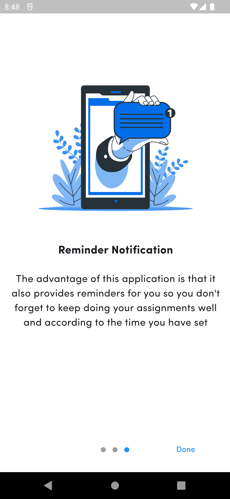

Here's a draft README for the TaskWan app:

---

# TaskWan

TaskWan is a feature-rich task management app built using Flutter, Firebase, and Hive. It allows users to manage their daily and priority tasks efficiently with a clean and intuitive interface.

## Features

- **User Authentication**: Secure user authentication using Firebase Authentication.
- **Task Management**: Create, update, and delete daily and priority tasks.
- **Calendar View**: Navigate through tasks using a calendar-based view.
- **Persistent Storage**: Store tasks locally using Hive and synchronize with Firebase.
- **Responsive UI**: Optimized for both mobile and tablet views.

## Screenshots
### Welcome Screens


### Authentication Screens



### Task Management Screens


### Additional Screens


## Installation

1. Clone the repository:
   ```bash
   git clone https://github.com/mouloud240/taskManager.git
   ```
2. Navigate to the project directory:
   ```bash
   cd taskManager
   ```
3. Install the dependencies:
   ```bash
   flutter pub get
   ```
4. Configure Firebase by following [Firebase setup guide](https://firebase.google.com/docs/flutter/setup).
5. Run the app:
   ```bash
   flutter run
   ```

## Technologies Used

- **Flutter**: This is used to build the user interface.
- **Firebase**: For user authentication and cloud storage.
- **Hive**: For local data storage.
- **Riverpod**: For state management.

## Contribution

Feel free to open issues and submit pull requests for any features or improvements you want.

## License

This project is licensed under the MIT License - see the [LICENSE](LICENSE) file for details.

## Contact

If you have any questions, feel free to reach me at mouloudhasrane24@gmail.com.

---

Make sure to add screenshots of your app, and update any links as needed!
